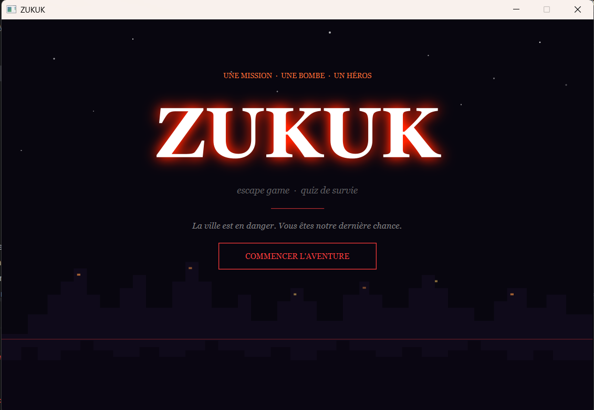
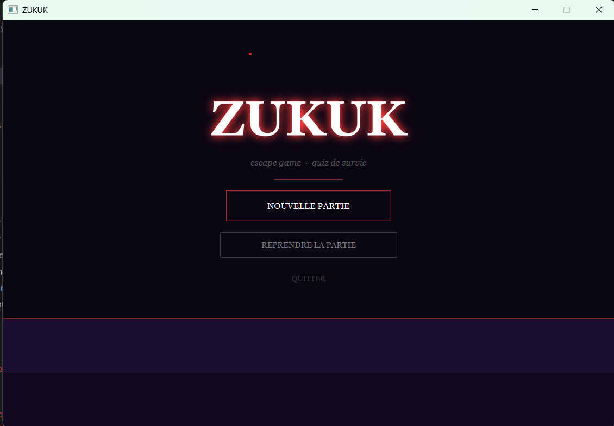
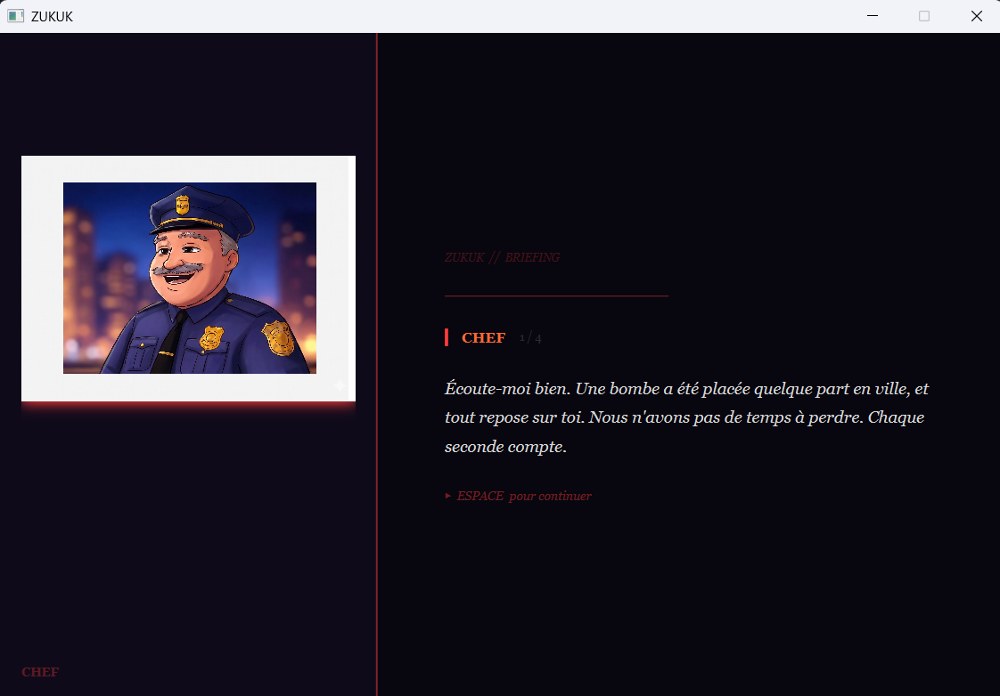
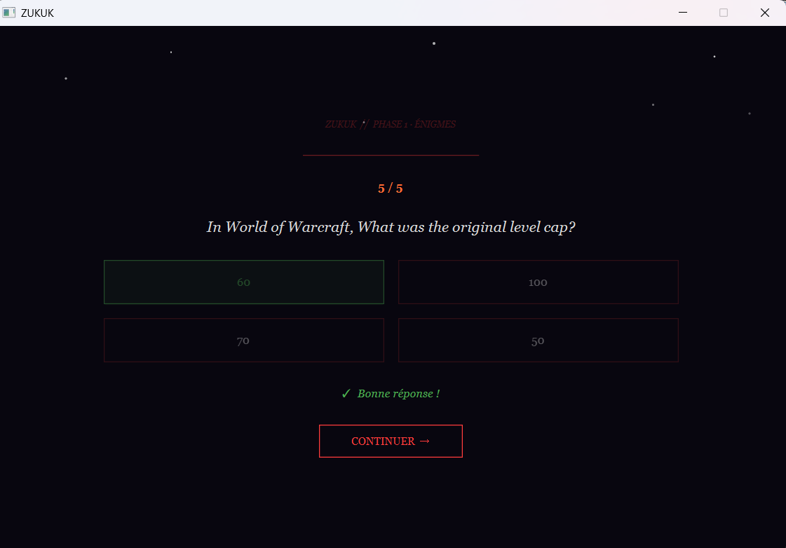
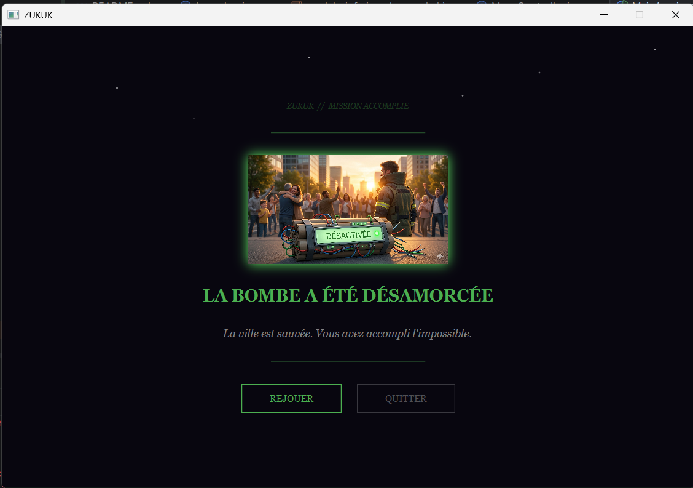
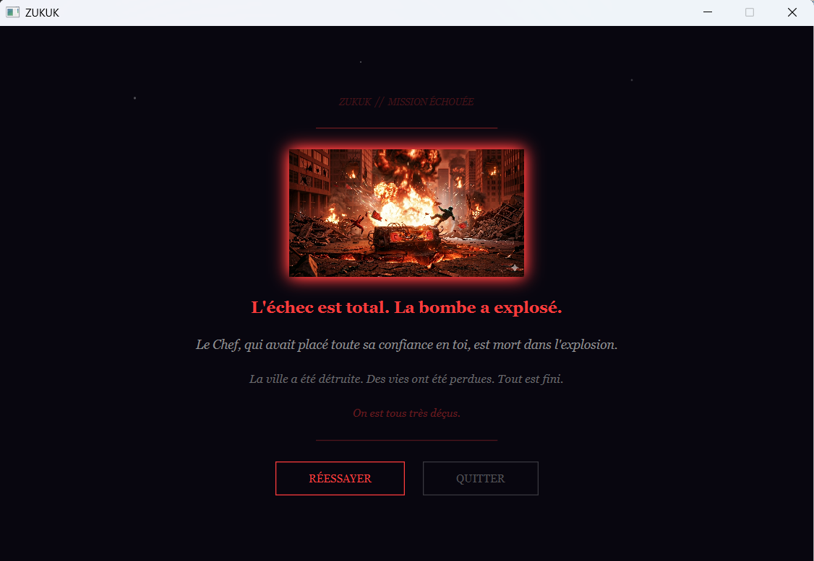

# 🎮 ZUKUK - Escape Game

> An interactive escape game Visual Novel where players solve quizzes to locate and defuse a bomb.

## 📋 Table of Contents

- [Overview](#overview)
- [Features](#features)
- [Screenshots](#screenshots)
- [Prerequisites](#prerequisites)
- [Installation](#installation)
- [Usage](#usage)
- [Game Flow](#game-flow)
- [Project Structure](#project-structure)
- [Building & Running](#building--running)
- [Technologies](#technologies)

---

## 🎯 Overview

ZUKUK is a JavaFX-based escape game developed as a school project. 
Players experience an interactive narrative with a series of quizzes. 
Solve all 5 questions correctly through multiple quiz rounds to 
successfully find and defuse the bomb before time runs out!

---

## ✨ Features

- 🎬 **Interactive Dialogue System** - Typewriter animation with keyboard interaction
- 🧩 **Multiple Quiz Rounds** - Three different quiz stages (Énigmes, Localisation, Déminage)
- 🌐 **Live API Integration** - OpenTDB API for randomized questions
- 💾 **Save/Load System** - JSON-based game state persistence with Gson
- 🎨 **JavaFX UI** - Cross-platform desktop interface
- 🏆 **Dual Endings** - Victory and defeat screens with consequences

---

## 📸 Screenshots

### 1️⃣ Accueil (Welcome Screen)

*Game launch screen with atmospheric introduction*

### 2️⃣ Menu (Main Menu)

*Start new game or continue saved progress*

### 3️⃣ Dialogue Introduction

*Chef brief explaining the bomb situation with typewriter effect*

### 4️⃣ Quiz Gameplay

*Quiz interface with 4-choice answers and score tracking*

### 5️⃣ Victoire (Victory)

*Success screen after defusing the bomb*

### 6️⃣ Défaite (Defeat)

*Game over screen when quiz attempts are exceeded*

---

## 📦 Prerequisites

- **Java**: JDK 17 or higher
- **Maven**: 3.8.0 or higher
- **Internet Connection**: Required for OpenTDB API calls

---

## 🚀 Installation

### 1. Clone the repository
```bash
git clone https://github.com/HOUDAED/Gameplay.git
cd Gameplay
```

### 2. Install dependencies
```bash
mvn clean install
```

---

## 💻 Usage

### Run the application
```bash
mvn javafx:run
```

Or run directly:
```bash
mvn clean compile javafx:run
```

---

## 🎮 Game Flow

```
┌─────────────────┐
│    Accueil      │  Welcome screen
└────────┬────────┘
         │
┌────────▼────────┐
│      Menu       │  New Game / Continue
└────────┬────────┘
         │
┌────────▼──────────────────────┐
│  Dialogue Intro (Chef)         │  Typewriter dialogue
└────────┬──────────────────────┘
         │
┌────────▼──────────────────────┐
│  QUIZ 1 : Énigmes              │  5 correct answers
└────────┬──────────────────────┘
         │
┌────────▼──────────────────────┐
│  Dialogue Inter1               │  Progress update
└────────┬──────────────────────┘
         │
┌────────▼──────────────────────┐
│  QUIZ 2 : Localisation         │  5 correct answers
└────────┬──────────────────────┘
         │
┌────────▼──────────────────────┐
│  Dialogue Inter2               │  Final briefing
└────────┬──────────────────────┘
         │
┌────────▼──────────────────────┐
│  QUIZ 3 : Déminage             │  5 correct answers
└────────┬──────────────────────┘
         │
    ┌────┴────┐
    │          │
┌───▼──┐    ┌─▼───┐
│Victoire│  │Défaite│
└────────┘  └──────┘
```

---

## 📁 Project Structure

```
src/
├── main/
│   ├── java/com/zukuk/
│   │   ├── Launcher.java
│   │   ├── MainApp.java
│   │   ├── controller/
│   │   │   ├── AccueilController.java
│   │   │   ├── MenuController.java
│   │   │   ├── DialogueController.java (abstract)
│   │   │   ├── DialogueIntroController.java
│   │   │   ├── DialogueInter1Controller.java
│   │   │   ├── DialogueInter2Controller.java
│   │   │   ├── DialogueFinalController.java
│   │   │   ├── QuizEnigmesController.java
│   │   │   ├── QuizLocalisationController.java
│   │   │   ├── VictoireController.java
│   │   │   └── DefaiteController.java
│   │   ├── model/
│   │   │   ├── QuizQuestion.java
│   │   │   └── SaveData.java
│   │   └── service/
│   │       ├── QuizApiService.java
│   │       └── SaveService.java
│   └── resources/com/zukuk/
│       ├── view/ (FXML files)
│       └── images/
│           ├── chef.png
│           ├── victoire.png
│           └── explosion.png
└── test/ (Unit tests)
```

---

## 🏗️ Building & Running

### Development
```bash
mvn clean compile
mvn javafx:run
```

### Package for distribution
```bash
mvn clean package -DskipTests
```

### Run JAR
```bash
java -jar target/zukuk-1.0-SNAPSHOT.jar
```

---

## 🛠️ Technologies

| Technology | Version | Purpose |
|-----------|---------|---------|
| Java | 17 | Core language |
| JavaFX | 21.0.6 | UI Framework |
| Maven | 3.13.0 | Build tool |
| Gson | 2.10.1 | JSON serialization |
| org.json | 20240303 | JSON parsing |
| JUnit | 5.12.1 | Testing framework |
| OpenTDB API | - | Quiz questions provider |

---

## 🎓 Learning Resources

- [JavaFX Documentation](https://openjfx.io/)
- [OpenTDB API Guide](https://opentdb.com/api_config.php)
- [Maven Guide](https://maven.apache.org/guides/)
- [Gson User Guide](https://github.com/google/gson/blob/master/UserGuide.md)

---

## 👥 Authors

- **Edvige** 
- **Kerem** 

**School Project** - Java Escape Game Assignment

---

## 📄 License

This is a school project. Feel free to use it for educational purposes.

---


## 🔄 Future Enhancements

- [ ] Sound effects and background music
- [ ] Difficulty levels
- [ ] Leaderboard system
- [ ] Mobile version
- [ ] Internationalization (i18n)
